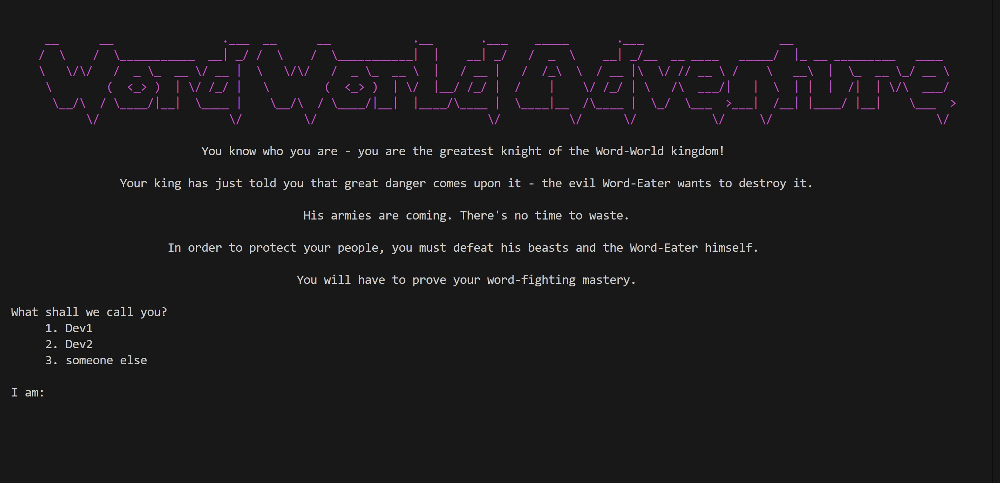

# Word World Adventure [UNIFINISHED]

A text-based adventure game where typing speed and accuracy determine your success in combat.

As of now, it is unfinished, only started in fact, and full of code and comments that will not stay in the final version but are suposed to be useful for other people in the team who will work on this project.



## Current Features

### Core Gameplay
- Turn-based combat system based on typing accuracy and speed
- Multiple difficulty levels with increasing word complexity
- Player statistics and rankings tracking
- Custom word lists support
- Multiple player profiles support
- Depending on mode chosen in settings:
    1. Combat using predefined words  
    2. Combat using a word API  

### Player Stats Tracking
- Games started/finished
- Fastest completion time
- Total enemies defeated
- Total player defeats
- Best typing times per word

### Word Stats System
- Word encounter tracking
- Average completion times
- Best completion times
- Error rate tracking
- Per-player performance history

### Training Mode
Two training modes available:
1. Level-based words (LVL1-3)
2. Custom words list

Run training mode:
```bash
python -m game.testing.trainer
```

### Analysis Tools
Various statistics and analysis tools available:
```bash
python -m game.testing.testing
```
Features:
- Word difficulty analysis
- Success rate tracking
- Average completion time graphs
- Word length vs. time correlation


### Planned Features
- Combat effects and modifiers
- Player Profile validation
- Multiple enemy types
- Room/Level system
- Weapon system
- Weapon variety and special abilities
- More diverse room types
- Quest system
- Item collection and usage
- Achievement system
- Random events
- Impoved time/word difficulty ratio

## Setup

1. Clone the repository
2. Create a virtual environment:
```bash
python -m venv venv
```
3. Activate the virtual environment:
```bash
# Windows
venv\Scripts\activate
# Linux/Mac
source venv/bin/activate
```
4. Install requirements:
```bash
pip install -r requirements.txt
```

## Usage

### Main Game
Run the main game:
```bash
python -m game.main
```

### Configuration
Settings can be modified in `settings.json`:
- Skip intro
- Difficulty settings
- Player profiles

## Tips
- Practice with the trainer module if you can't pass certain levels
- Use trainer to test words (as a dev) - whether they are suitable for adding or not
- Watch your typing accuracy - errors count against you
- Pay attention to word length vs. time limit ratio
- Use custom word lists to practice specific patterns

## Known Issues
- Path resolution in some IDEs
- Stats file creation on first run
- Unicode handling in Windows terminal